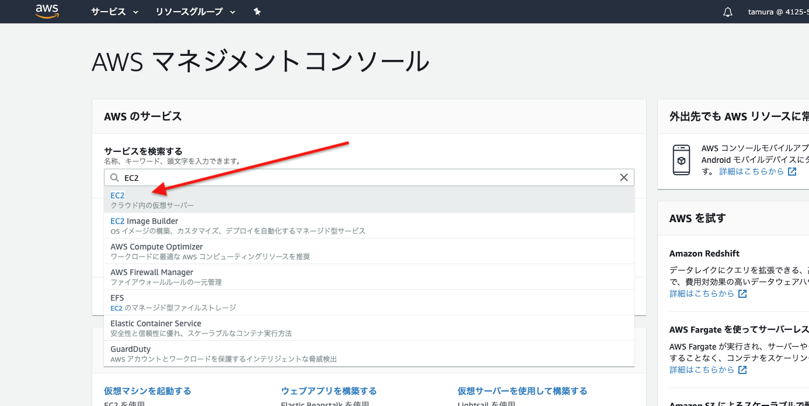
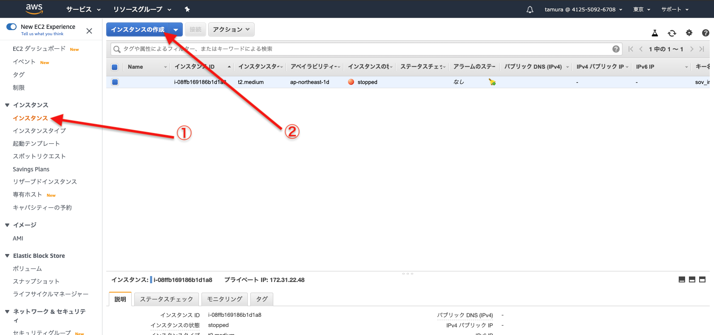
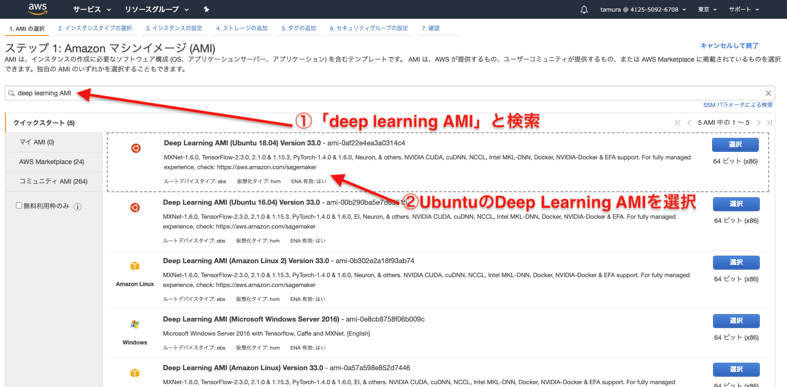
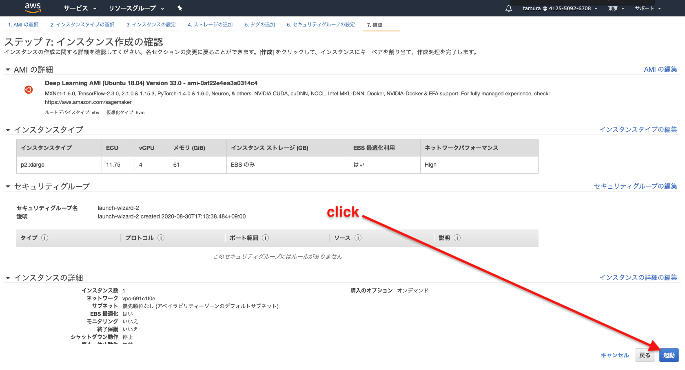
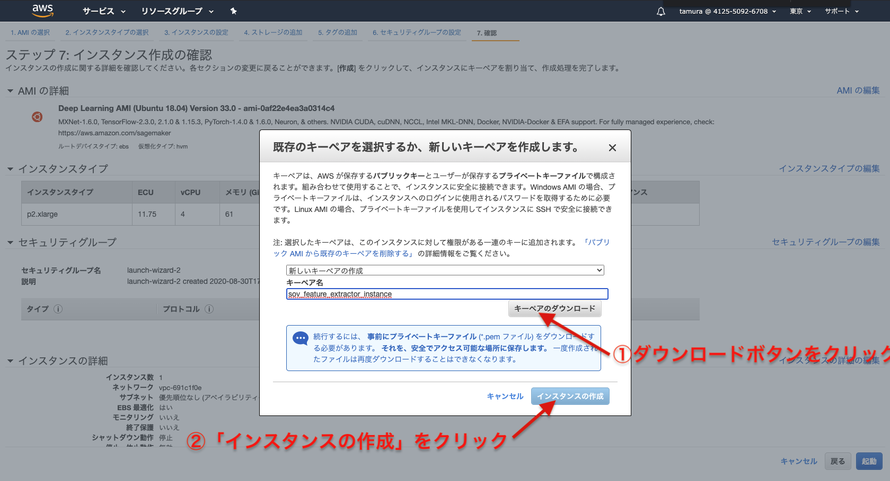
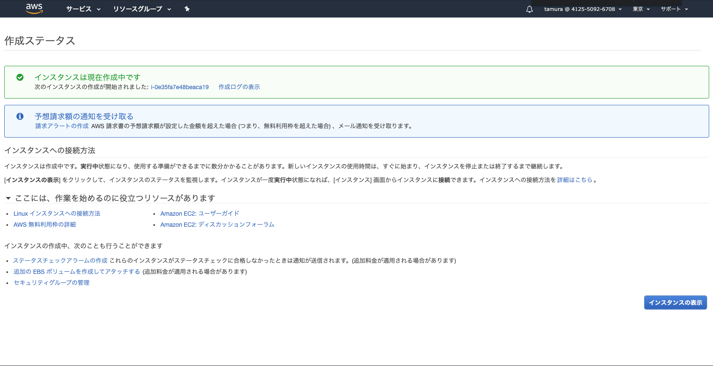
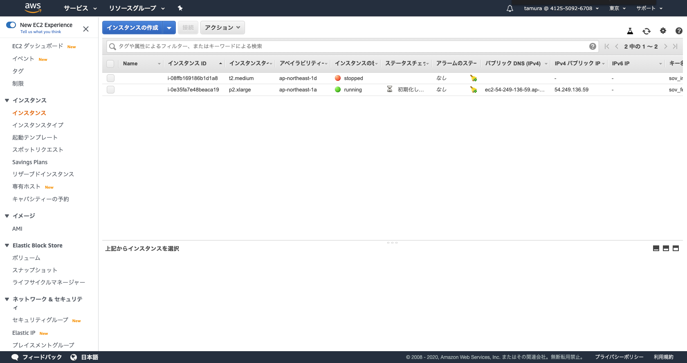
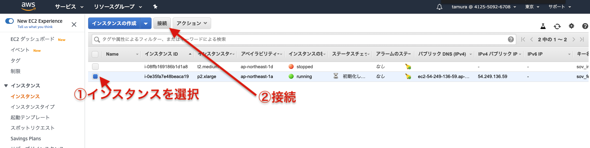
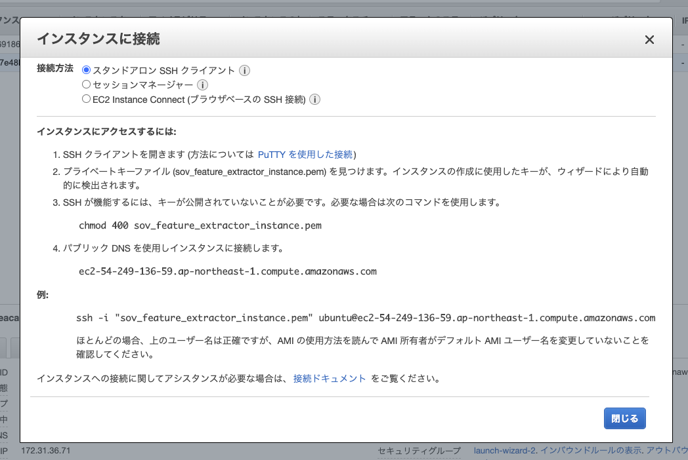

# P2インスタンス
EC2 P2インスタンスを作成して、Tensorflowを学習する方法について紹介します。

 - [Amazon EC2 P2 インスタンス| AWS](https://aws.amazon.com/jp/ec2/instance-types/p2/)
 - [AWSでGPUを使った機械学習環境を使うためのプロセス - Qiita](https://qiita.com/RHM/items/24d7f79ea6417ab78621)
 - [p2 インスタンスへの TensorFlow 導入 - Qiita](https://qiita.com/halhorn/items/361008b19b4fcfd618d6)
 
## インスタンスの作成方法








起動ボタンを押すと以下のようなポップアップが表示されるので、キーペアを作成もしくは既存のキーペアを作成します。

新たにキーペアを作成した場合は、`.pem`ファイルをダウンロードしてください。




## インスタンスへ接続



接続ボタンを押すと、次のようなポップアップ画面が表示されます。
今回では、「スタンドアロンSSHクライアント」方法による接続を行います。記載されている通りに各手順を実行します。


```bash
$ ls -al <pemファイル名>.pem
-rw-r--r--@ 1 taiyou  staff  1692  8 30 17:21 <pemファイル名>.pem

$ chmod 400 <pemファイル名>.pem
$ ls -al <pemファイル名>.pem
-r--------@ 1 taiyou  staff  1692  8 30 17:21 <pemファイル名>.pem

$ ssh -i "<pemファイル名>.pem" ubuntu@ec2-54-249-136-59.ap-northeast-1.compute.amazonaws.com

# ...

ubuntu@ip-172-31-36-71:~$ hostname
ip-172-31-36-71
ubuntu@ip-172-31-36-71:~$ pwd
/home/ubuntu
ubuntu@ip-172-31-36-71:~$ ls
LICENSE  Nvidia_Cloud_EULA.pdf  README  anaconda3  examples  src  tools  tutorials
```

## Tensorflowの学習
```bash
ubuntu@ip-172-31-36-71:~$ mkdir 作業用ディレクトリ

# TensorFlow 2系 × Python3.6系を指定
ubuntu@ip-172-31-36-71:~$ source activate tensorflow2_p36
ubuntu@ip-172-31-36-71:~$ python
>>> import tensorflow as tf
>>> assert tf.test.gpu_device_name() == '/device:GPU:0', "GPU環境ではありません"
```