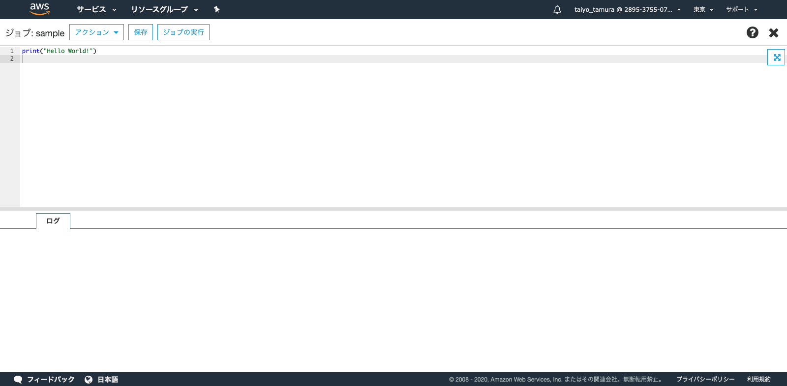

# [Glue](https://docs.aws.amazon.com/ja_jp/glue/latest/dg/what-is-glue.html)
## [Pythonシェルジョブを追加](https://docs.aws.amazon.com/ja_jp/glue/latest/dg/add-job-python.html)

### Glueを選択

### ジョブを選択

### ジョブの追加

### ジョブの確認
