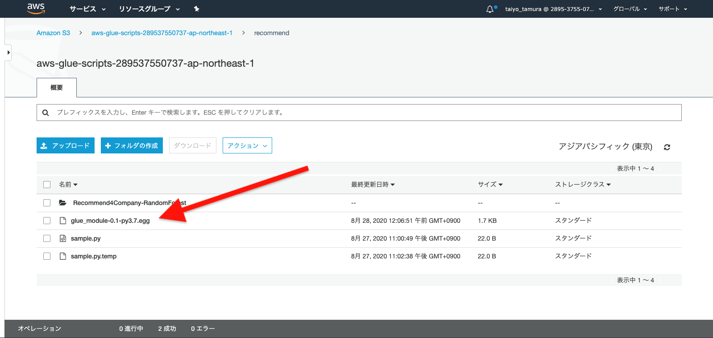
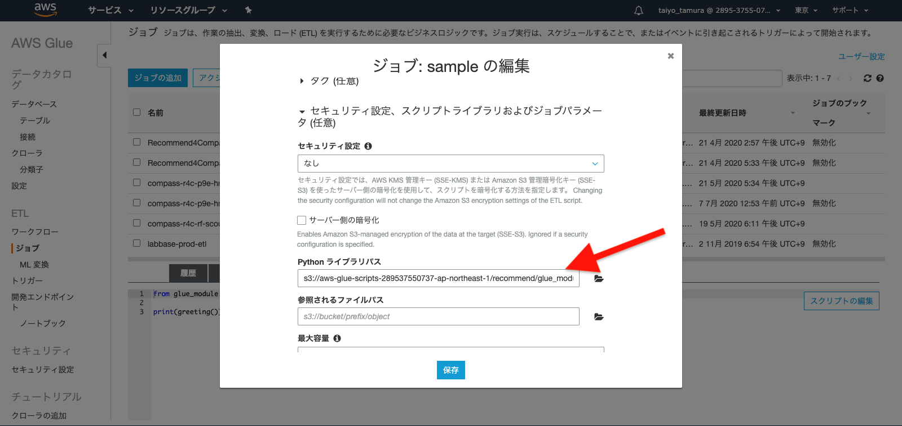
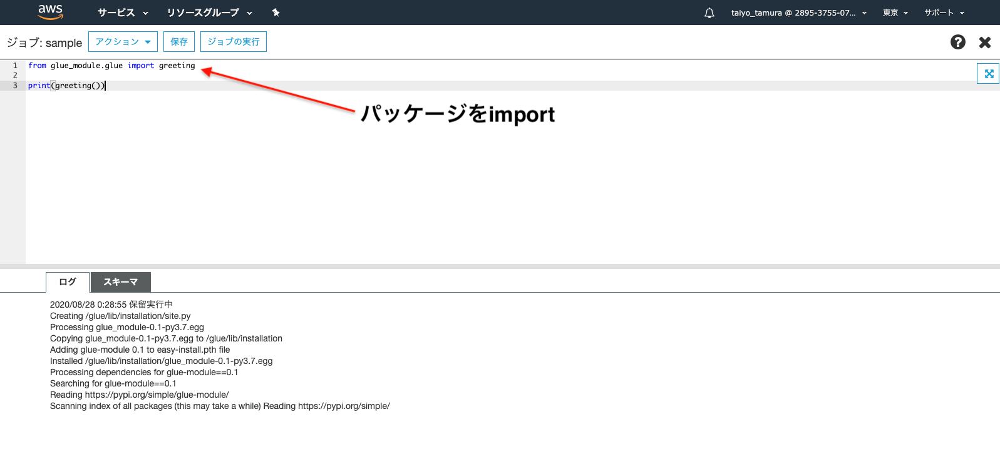

# [独自のPythonライブラリの利用方法](https://docs.aws.amazon.com/ja_jp/glue/latest/dg/add-job-python.html#create-python-extra-library)

## 1. Pythonライブラリを`.egg`または`.whl`ファイルとしてパッケージング
### ライブラリの実装
以下の構造の`example`フォルダを用意します。
```
example
├── glue_module
│   ├── __init__.py  # 空のファイル
│   └── glue.py
└── setup.py
```

`glue.py`
```python
def greeting():
    return "Hello From External Library"
```

`setup.py`
```python
from setuptools import setup

setup(
    name="glue_module",
    version="0.1",
    packages=['glue_module']
)
```

### パッケージング
用意が完了したら、以下のいずれかの操作を行い`.egg`,`.whl`ファイルを作成します。
<b color="red">この時、pythonのバージョンを3.6にして実行してください！他のバージョンで実行するとGlueジョブでエラーになります。</b>
```bash
$ python --version
Python 3.6.0
```

 - [AWS Glue Python-Shell : How to provide your own library? - Stack Overflow](https://stackoverflow.com/questions/57501378/aws-glue-python-shell-how-to-provide-your-own-library)
 - [AWS Glue リリースノート - AWS Glue](https://docs.aws.amazon.com/ja_jp/glue/latest/dg/release-notes.html)

`.egg`ファイルを作成するには、次のコマンドを実行します。
```python
python setup.py bdist_egg
```
`.whl`ファイルを作成するには、次のコマンドを実行します。
```python
python setup.py bdist_wheel
```

実行すると、以下のような`dist`ディレクトリが生成されます。(○○○-py3.6.eggであることを確認してください！Pythonのバージョンを表します)
```
example
├── build
│   ├── bdist.macosx-10.7-x86_64
│   └── lib
│       └── glue_module
│           ├── __init__.py
│           └── glue.py
├── dist
│   └── glue_module-0.1-py3.6.egg  # ← S3に配置します
├── glue_module
│   ├── __init__.py
│   └── glue.py
├── glue_module.egg-info
│   ├── PKG-INFO
│   ├── SOURCES.txt
│   ├── dependency_links.txt
│   └── top_level.txt
└── setup.py

7 directories, 10 files
```
`dist`ディレクトリ直下の`.egg`ファイルもしくは`.whl`ファイルをS3に配置します。

### パッケージの利用
パッケージングした`.egg`ファイルもしくは`.whl`フィイルをS3に配置します。



配置したら、ジョブの「セキュリティ設定、スクリプトライブラリおよびジョブパラメータ (任意)」項目の「Pythonライブラリパス」に配置したファイルパスを指定します。
下の画像では、作成済みのジョブの「Pythonライブラリパス」に対して入力していますが、新規にジョブを作成する際に入力していただいても構いません。

