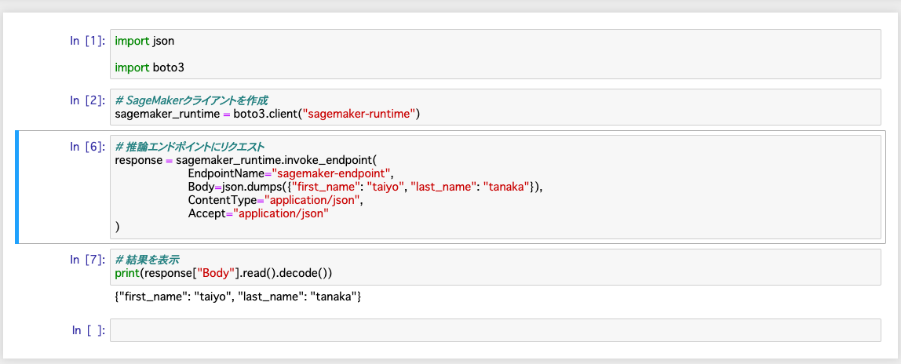

# API

## 起動方法
```bash
# ECRにイメージをプッシュ
$ sh build_and_push.sh <イメージ名>

# ex
$ sh build_and_push.sh sagemaker-api
```

イメージがECRにプッシュされたことを確認


次に、モデルを起動します。


モデルを起動できたら、エンドポイントの設定を行います。


最後にエンドポイントを作成してデプロイします。


### 動作確認
jupyterによる動作確認



curlによる動作確認
```bash
curl -XPOST /endpoints/EndpointName/invocations \
     -H "Content-Type: application/json" \
     -H "Accept: application/json" \
     -H "X-Amzn-SageMaker-Custom-Attributes: CustomAttributes" \
     -H "X-Amzn-SageMaker-Target-Model: TargetModel" \
     -H "X-Amzn-SageMaker-Target-Variant: TargetVariant" \
     -d '
{
    "first_name": "taiyo",
    "last_name": "tamura"
}
'
```