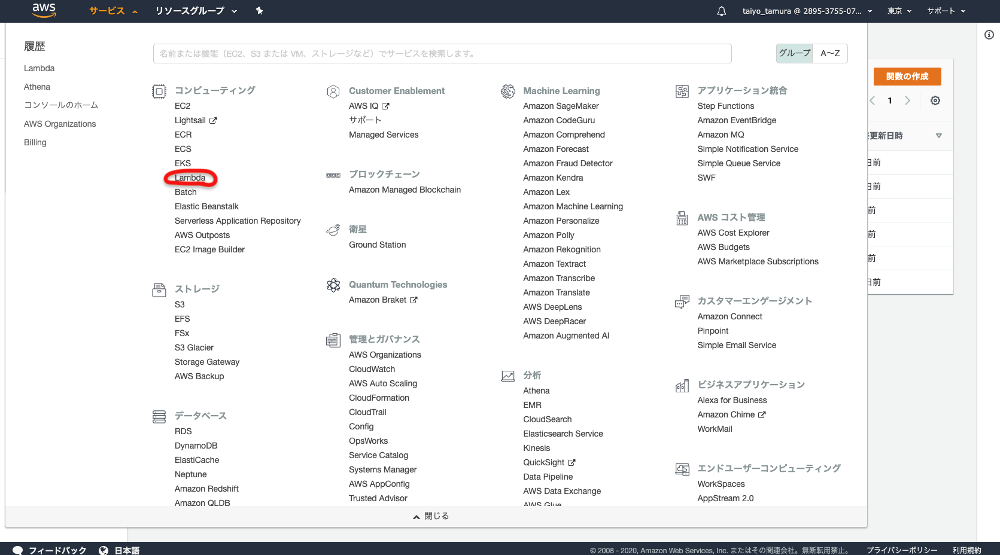

# lambda

## チュートリアル

### 1. Lambdaコンソールを起動する

### 2. 関数を作成する

関数の種類

 - 「一から作成」
 - 「設計図の使用」
 - 「Serverless Application Repositoryの参照」

### 3. Lambda関数の設定して作成する

### 4. Lambda関数を呼び出して結果を検証する

---
## 参考資料

 - https://aws.amazon.com/jp/getting-started/tutorials/run-serverless-code/
 - https://aws.amazon.com/jp/lambda/